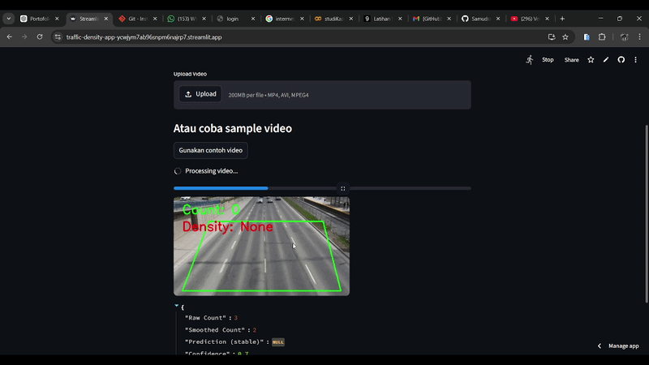

# 🚦 Traffic Density Detection using YOLOv8 & Machine Learning

## 📌 Overview
This project detects traffic density from video using Computer Vision and Machine Learning.

Users can:
- Upload video
- Detect vehicles using YOLOv8
- Analyze traffic condition (smooth, dense, jammed)

🔗 Live App:
https://traffic-density-app-ycwjym7ab96snpm6najrp7.streamlit.app/

---

## 🎯 Problem
Traffic congestion is a major issue in urban areas.  
This project aims to automatically analyze traffic density using video.

---

## ⚙️ How It Works
1. Input video (upload / sample)
2. Frame processing (resize + skip)
3. Vehicle detection (YOLOv8)
4. Feature extraction:
   - Count
   - Density
   - Flow
   - Variance
5. ML model predicts traffic condition

---

## 🧪 Tech Stack
- Python
- OpenCV
- YOLOv8
- Scikit-learn
- Streamlit

---

## 📊 Features
- Traffic detection from video
- Stable prediction (anti flicker)
- Sample video support
- Progress bar

---

## ⚠️ Limitations
- Not fully real-time
- Limited by CPU (Streamlit Cloud)
- Accuracy depends on video quality

---

## 🚀 Future Improvements
- GPU deployment
- Real-time CCTV integration
- Better detection model

---

## 🎥 Demo

Note:
Due to cloud limitations, YOLO inference is demonstrated locally.